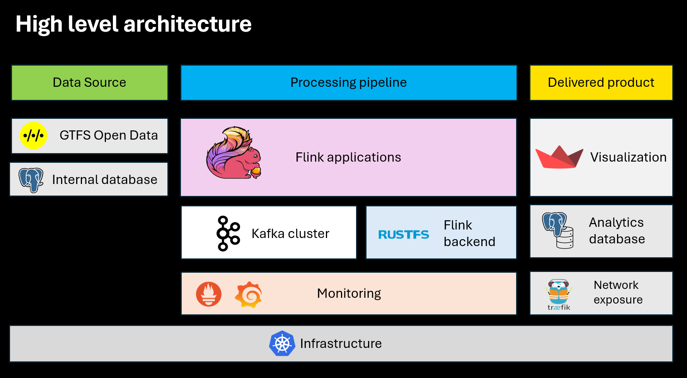
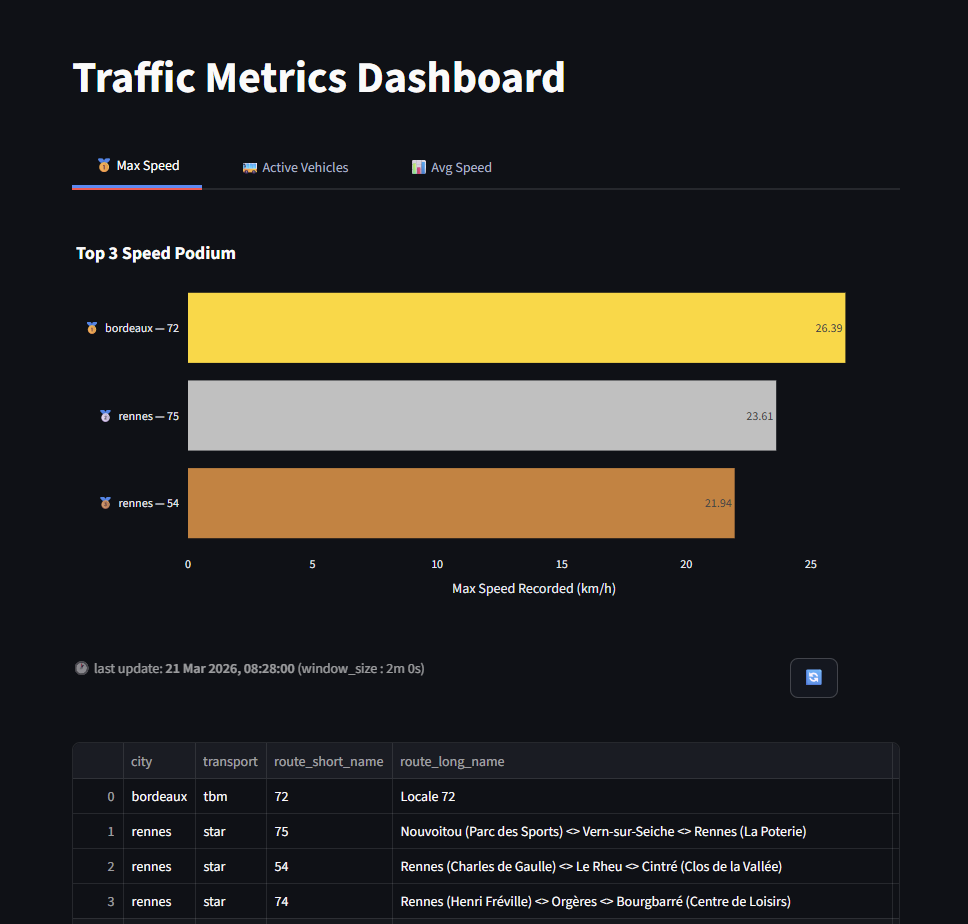

<h1 align="center">
  Asphalt: Real-Time Vehicle Data Processing Pipeline
</h1>

  

 

**Asphalt** is a scalable, real-time data processing pipeline designed to extract actionable insights from vehicle position data.  Built for flexibility and resilience, it adapts to evolving data schemas and diverse use cases.

📖 **Full Documentation available at**: [https://markov-ngz.github.io/Asphalt](https://markov-ngz.github.io/Asphalt)

---

## Project Overview

### Core Technologies
- **Apache Flink**: Real-time data processing engine
- **Apache Kafka**: Distributed event streaming platform
- **Kubernetes (K8s)**: Orchestration for scalable deployment (Docker setup also available)

<figure markdown="span">
  
</figure>

### Data Flow
Asphalt ingests, processes, and analyzes vehicle position data in real time, enabling:
- Dynamic integration of new data sources
- Seamless schema evolution ( medallion architecture )
- Support for emerging use cases 
- Robust handling of real-time challenges (watermarks, state management, window computations)

<figure markdown="span">
  
</figure>

## Data Visualization & Insights

All processed data is visualized in an intuitive dashboard, providing real-time traffic analytics for each route or line. Key metrics include:

- **Maximum speed**: Identify peak performance and potential bottlenecks.
- **Average speed**: Monitor overall traffic flow efficiency.
- **Active vehicles**: Track fleet utilization and operational density.

<figure markdown="span">
  
  <figcaption>Example: Real-time maximum speed visualization per route</figcaption>
</figure>

---

## Cite and share 

Please add a star ✨ to the repository if you liked the work and the overall presentation 😊 