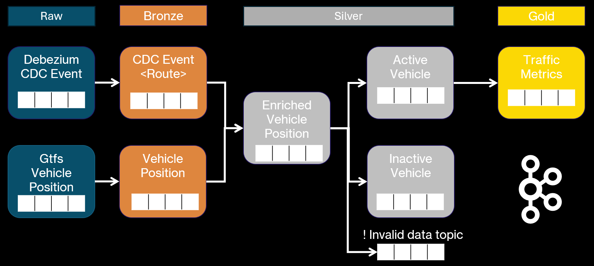
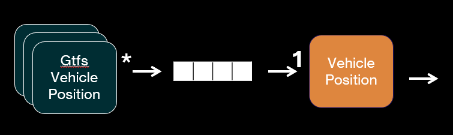
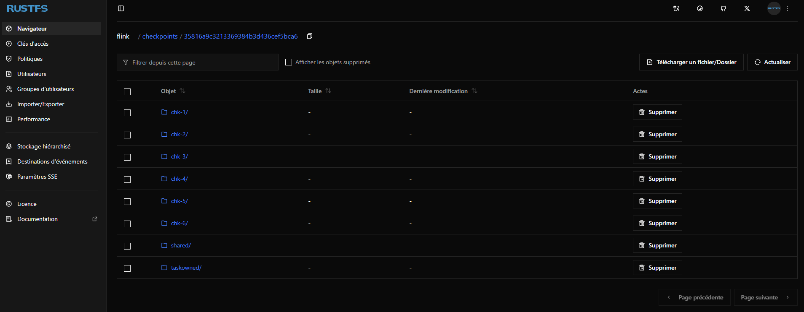
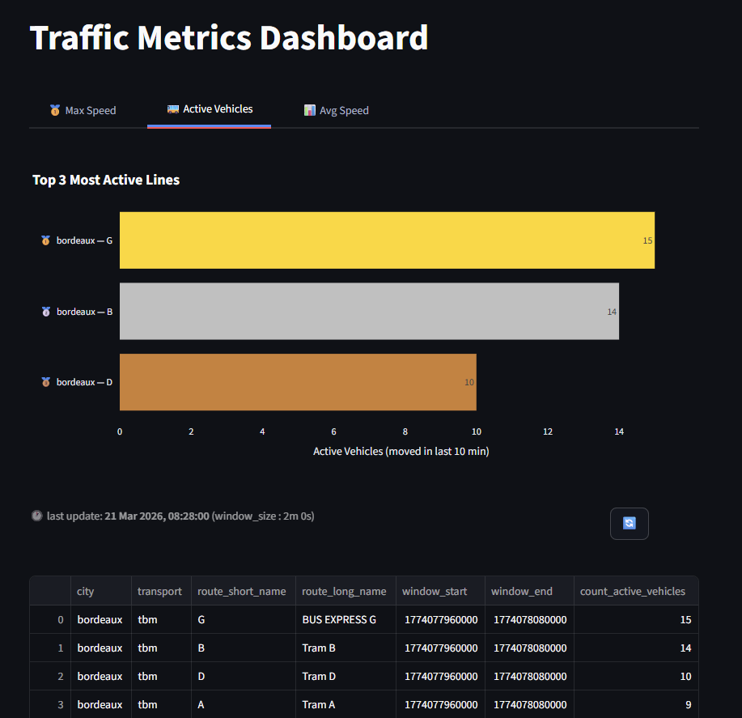

# Applicative 

In order to respond to the goals, 
applications

## 1. Message queues ✉︎

The data of the multiple events is stored into message queues which are in this case [Kafka topics](https://kafka.apache.org/42/getting-started/introduction/#main-concepts-and-terminology).

### 1.1 Topic naming pattern 
The topics are named using the following pattern : 
```sh
<env>.<level>.<model>.<version> 
```

- **env**: the development environment used ( dev , staging, prod )
- **level**: the data medallion level to which they belong ( bronze, silver , gold )
- **model**: the object stored into the topic 
- **version**: the version fo the object 

### 1.2 Topic Architecture
The queues reflect the data model decided for the project, it is our storage layer.<br>

The key point is the `invalid data` topic where all the errors from data quality checks will be sent to to be processed or troubleshooted.

<figure markdown="span">
  
  <figcaption>Map of the topics in the project</figcaption>
</figure>

### 1.3 Data Format
Two different data formats are used to send information across the topics : json & protobuf

The protobuf schemas are tied to the `asphalt-core` project library.
Doing so will allow a versionning of those schemas and common (de)serializers.

In order to create the class allowing us to handle the objects , the [`protoc`](https://protobuf.dev/overview/) command line is used.

---
## 2. Flink 🐿️
[Flink](https://nightlies.apache.org/flink/flink-docs-release-2.2/) is a framework for real time applications. Hence it fits perfectly our need.

In this project, flink jobs are developed using the : 

- **Datastream API**: for complex jobs like stream connecting and window functions ( it allows a more hands-on approach )
- **SQL API / Table API** : SQL approach which is particularly handy for simple jobs ( like exporting the data )

### 2.1 Generic Jinja Flink SQL job 
SQL jobs can be submitted to a flink cluster using the [Rest API](https://nightlies.apache.org/flink/flink-docs-release-2.2/docs/ops/rest_api/) or connecting directly to flink SQL console.

The problem with those 2 ways are the deployment mode to a k8s cluster.

It differs from a standard Flink jobs developed in java which is embedded to a Docker image and then deployed using a `FlinkDeployment` CRD.

So in order to have uniform deployment method, a generic job is developed.

It uses the specified job specified in [`flink-kubernetes-operator`](https://github.com/apache/flink-kubernetes-operator/tree/main/examples/flink-sql-runner-example) repository.
With the specificity that it allows ``{{ jinja }}`` usage ! 

Hence SQL files can be eused and easily parametered across environments.

### 2.2 Generic GTFS Vehicle Position extractor
As GTFS is an open standard, countless jobs can be deployed and directly insert raw data to our system !

The project mainly uses 2 sources of data, but many more can be added :

- Star Rennes :  <a>https://transport.data.gouv.fr/datasets/versions-des-horaires-theoriques-des-lignes-de-bus-et-de-metro-du-reseau-star-au-format-gtfs</a>
- TBM Bordeaux : <a>https://transport.data.gouv.fr/datasets/offres-de-services-bus-tram-et-scolaire-au-format-gtfs-netex-gtfs-rt-siri-lite</a>

<figure markdown="span">
  
  <figcaption>Multiple sources, One job </figcaption>
</figure>


What if a new data format comes up ?<br> 
Just develop a new Bronze job and just map it to the domain's `vehicle position`

### 2.3 CDC event for data enrichment
This is key and most technical point of the project : 

- How to handle changes to enrich the vehicle position with route ? 
- If the route information changes, how to ensure the data stays up to date ? 

Subscribing to the changes of the route data update a state which will mirror the content of the table.<br>
2 types of events are defined here :

- Insert/Update : it will just map the 
- Deletion : tricky because the watermarking of the job needs to be handled appropriatively.

**Example of problematic watermarking handling :**

Time T :<br>
- Event referencing Route A is created

Time T+1 :<br>
- Route A is deleted 

Time T+2 :<br>
- Event arrives into the system with latency
- Route deletion also comes in

How to ensure the Event which is older from Route deletion still is enriched ? 
Watermarking and proper state is solving the issue.

### 2.4 Flink state backend choice

A RustFS instance is used here to save the flink checkpoints and savepoints.

The Forst state backend is used here but from the volume, please not that Rocks DB is definitely the way to go in this case. The main goal was to access the state asynchronously and discover those parameters.

<figure markdown="span">
  <figcaption>Storage files structure</figcaption>
  
</figure>


## 3. Init container 📦 : Gtfs Route data loader 

To easily setup the database from scratch, init containers are used to load data into the database.

Hence a job GTFS data loader allows to download GTFS static data into the database by specifying the parameters.

## 4. Streamlit visualization 🎈

To finalize the hand made approach of this project, superset or any visualization open source tools are not used here.
[Streamlit](https://github.com/streamlit/streamlit) allows a really nice and simple interface to present the data with custom ways.

<figure markdown="span">
  <figcaption>Visualization view</figcaption>
  {width=75%}
</figure>

Multiple tab show the metrics aggregated over defined sliding window with a specified size. The window parameters are configured over the flink job.