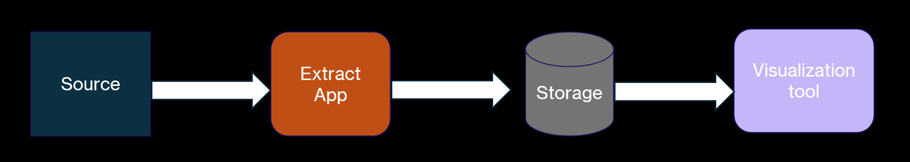
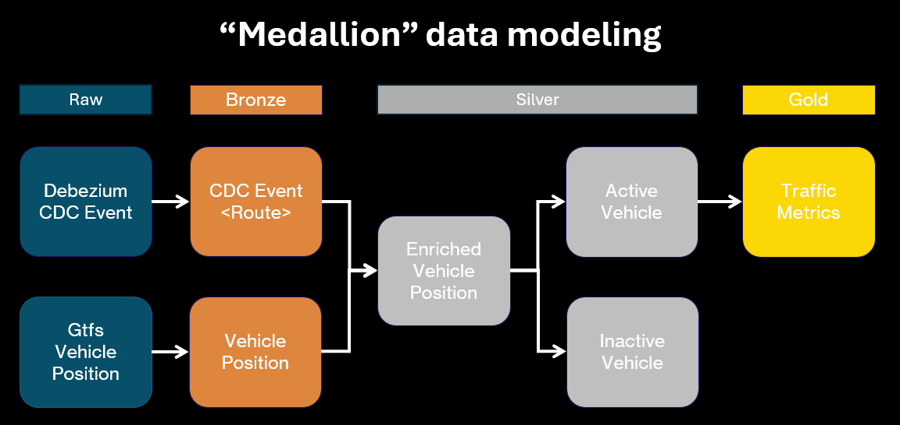

# Data model

## 1. Data provided
From the [GTFS]() standard, we use 2 models :

- <u>vehicle position</u> : realtime information with protobuf
- <u>routes</u> : static data changing every months

An example of data retrieved for the 2 models can be found [below](#raw-data-samples).

From this, the goal is to enrich the vehicle position with the route information to compute insightful traffic metrics.

## 2. The straight road approach 
As only 2 types of data are fetched, a simple approach would be to :

1. Ingest the raw gtfs data into a table
2. Create a view to compute the appropriate metrics joined with the routes

<br/>
<figure markdown="span">
  
  <figcaption>The straight road approach </figcaption>
</figure>

And for our usecase, <u>it would work</u>. And it's really important to acknowledge that this simple approach is definetely a way to do this.

However let's  put a bit more context to our usecase :

- What if there is a new usecase needing the same data  ?
- How to handle data quality ? 
- How to handle schema evolution ? ( the final product is tightly coupled to the source )
- How to add different sources of data ? 
- Again for new usecase, how to share common data transformation to avoid repetitions ? 
- If the routes changes, how to have matching historical updates ? 

Some limits are clearly defined here and a more complex model might come in handy.

## 3. Medaillon introduction
This is where the [medallion model](https://learn.microsoft.com/fr-fr/azure/databricks/lakehouse/medallion#example-medallion-architecture) is introduced with its clear defined steps of bronze/silver/gold.
Even though those steps do not always fit for real complex data transformation, it fits pretty well in this case .

To adapt it to our applications , the different layers are defined as :

- <u>raw</u> : source data coming from different format 
- <u>bronze</u> : standardized object decoupled from source ( proprietary model )
- <u>silver</u> : joined and common  business transformations to avoid redundancy in the marts logics
- <u>gold</u> : final product 

<br/>
<figure markdown="span">
  
  <figcaption>Medaillon model adopted</figcaption>
</figure>


The approach here is clearly to apply the common structure of a dbt project to realtime data processing.

The con here is that the storage and transformations are not optimized for an operational perspective. 


## Annexe

The open standard documentation can be found at : <a>https://gtfs.org/</a><br>
An example of data source available : <a>https://transport.data.gouv.fr/resources/83026</a>

### Raw data samples
**Vehicle position** : 

```json
    {
      "id": "RTVP:T:b_268437156_17",
      "vehicle": {
        "currentStopSequence": 50,
        "position": {
          "bearing": 184.0,
          "latitude": 44.7996711730957,
          "longitude": -0.5574740171432495,
          "odometer": 16244.0,
          "speed": 7.777777671813965
        },
        "stopId": "3369",
        "timestamp": "1773784045",
        "trip": {
          "directionId": 1,
          "routeId": "15",
          "tripId": "b_268437156_17"
        },
        "vehicle": {
          "id": "ineo-bus:1723",
          "label": "COURREJEAN"
        }
      }
    }
```

**Route information** : 


| route_id   | agency_id | route_short_name | route_long_name                                                                                     | route_desc   | route_type   | route_url | route_color | route_text_color | route_sort_order |
|------------|-----------|------------------|-----------------------------------------------------------------------------------------------------|--------------|--------------|-----------|-------------|------------------|------------------|
| 6-1001     | 1         | a                | Rennes (J.F. Kennedy) <> Rennes (La Poterie)                                                        | Métro        | 1            |           | EE1D23          | FFFFFF           | 1                |
| 6-1002     | 1         | b                | Cesson-Sévigné (Cesson - Viasilva) <> Rennes <> Saint-Jacques-de-la-Lande (Saint-Jacques - Gaîté) | Métro        | 1            |           | 00893E          | FFFFFF           | 2                |
| 6-0001     | 1         | C1               | Saint-Grégoire (Champ Daguet) <> Rennes <> Chantepie (Rosa Parks)                                    | CHRONOSTAR   | 3            |           | 95C11E          | 1A171B           | 1001             |
