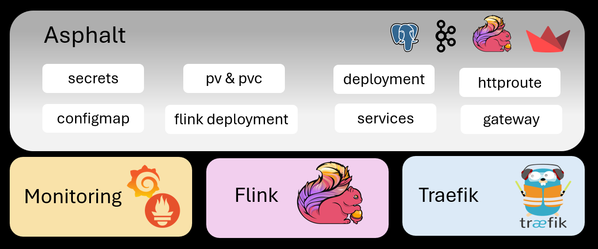
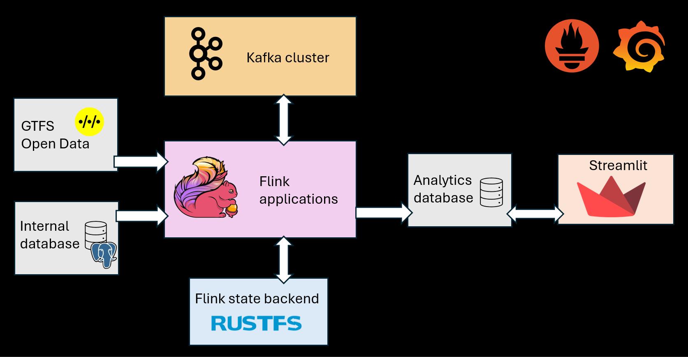
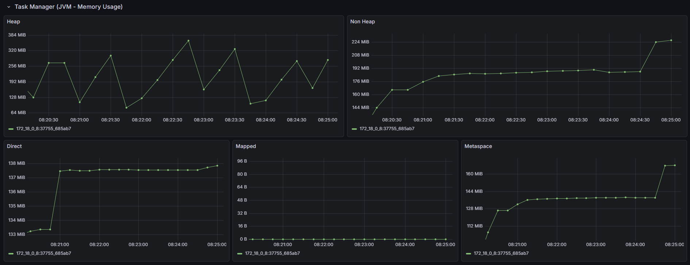

# Technical architecture

## 1. K8s 

Multiple type of resources are deployed :

- monitoring
- flink jobs
- database
- kafka cluster
- Gateway 

Here is a view of how they are structured into the cluster.

## 1.1 Namespaces
The resources are organized into 4 main namespaces :

- **asphalt** : project specific with flink jobs, kafka cluster and database 
- **flink** : base flink operator resources
- **monitoring** : podmonitors and grafana/prometheus resources
- **traefik**  : gatewayclass to expose services 

<figure markdown="span">
  
  <figcaption>Namespace resources overview</figcaption>
</figure>

## 1.2 Asphalt namespace 

### 1.2.1 Flink Jobs 
Flink jobs are deployed in application mode, meaning there is a flink deployment object per job (job manager and task manager ). 

**State Backend** 
Rustfs is used as s3 api compatible backend. It store the checkpoints of the jobs.

**Yaml Factorization** 
The yaml describing them is factorized using `kustomize` tool.

Resources for those jobs are defined under the resources and precise memory configuration was set in order to be able to deploy all the jobs on a single node cluster which do not have many powers.

### 1.2.2 Kafka cluster

The kafka setup here is really poor: 

- a single broker holding both role broker and controller
- kraft and not zookeeper 
- no security protocol : plaintext

### 1.2.3 Data visualization
A streamlit application is deployed and exposed via the [API gateway](https://gateway-api.sigs.k8s.io/concepts/api-overview/).

**NOTE :**  
As the core namespace, it is has the flaws of having too much things : 

- database
- kafka cluster 
- flink deployment jobs
- Data visualization
- Gateway and httproute to expose data visualization 

The kafka cluster should be hosted into a different namespace, same for database. 
However for the size of the project, centralizing everything at the same place was handy and simpler to conceptualize.

## 2. Docker 
The resources can be found from k8s deployment with the difference : 
- flink is deployed with session mode

Meaning a cluster is running multiple jobs, it allows to reduce the memory and have a more friendly setup.

<figure markdown="span">
  
  <figcaption>Main docker resources </figcaption>
</figure>

## 3. Monitoring 
In order to monitor the flink applications, a provided dashboard is used : 
<a>https://grafana.com/grafana/dashboards/14911-flink/</a>

As it is not maintained , some metrics are not compatible but the memory for jobmanager and taskmanager are still set which was the main point here.

The result is the following : 
<figure markdown="span">
  
  <figcaption>Grafana dashboard view</figcaption>
</figure>

This dashboard provides information about the taskmanager memory usage : 

- **heap**: Memory used by Java objects allocated during runtime
- **non heap**: Memory used by the JVM itself, excluding heap (method area, code cache)
- **direct**: Off-heap memory allocated directly by native code ( NIO buffers)
- **mapping**: Memory mapped files or regions used by the JVM
- **metaspace**: Memory used for class metadata and loaded classes

No applicative insights are set even though for real use case it is essential to defined dashboard matching the respect of the defined SLI, SLA and SLO.
